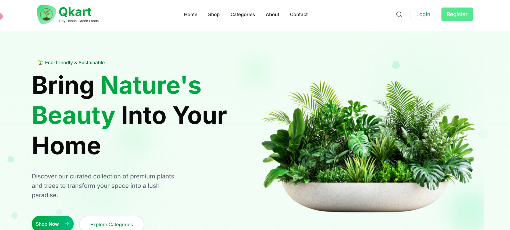
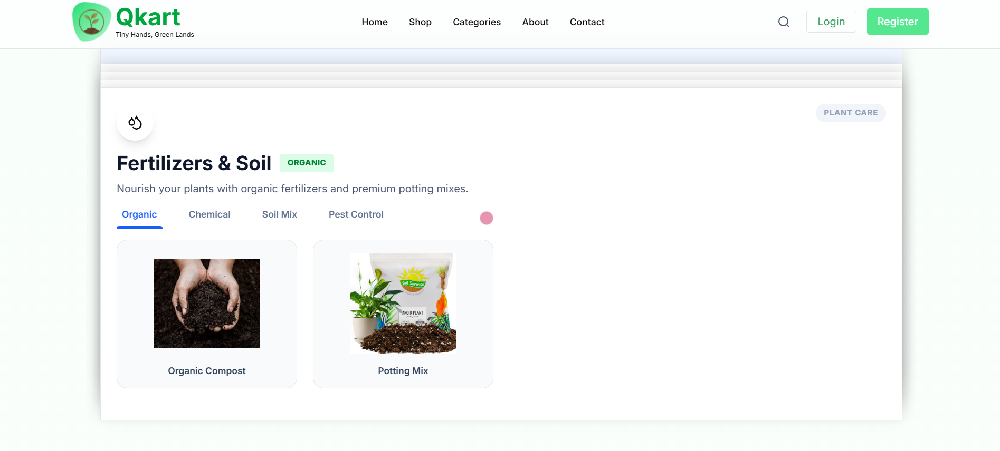
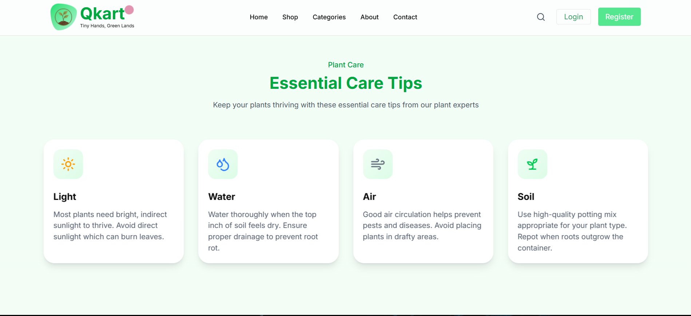
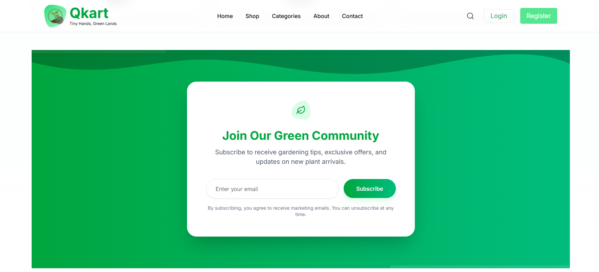
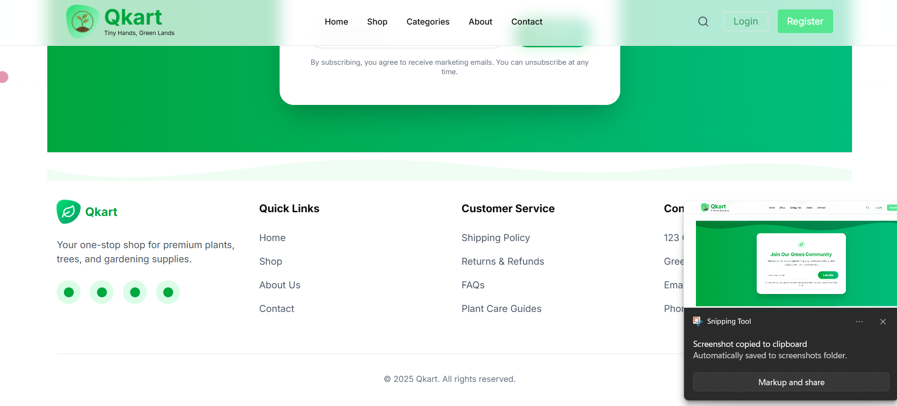

# Qkart - Tiny Hands, Green Lands 🌿

Qkart is a modern, eco-friendly e-commerce platform dedicated to bringing nature's beauty into homes. It serves as a one-stop shop for premium plants, trees, gardening supplies, and organic fertilizers.

Beyond just selling products, Qkart aims to build a green community by providing essential plant care tips and sustainable gardening solutions.

## 📸 Screenshots

### Home Page & Hero Section
*A welcoming landing page featuring a clean design and clear call-to-actions.*


### Shop & Categories
*Intuitive product categorization including Organic Fertilizers, Soil Mixes, and Pest Control.*


### Why Choose Qkart
*Highlighting our core values: Premium Quality, Fast Delivery, and 30-Day Guarantees.*


### Plant Care Guides
*Educational section providing essential tips on Light, Water, Air, and Soil maintenance.*


### Newsletter Subscription
*Community engagement section for gardening tips and exclusive offers.*


### Footer & Quick Links
*Comprehensive footer with navigation, policies, and contact information.*


---

## ✨ Features

-   **Modern UI/UX:** A clean, soothing green aesthetic designed with user experience in mind.
-   **Product Categorization:** Tabbed interfaces for easy navigation between Organic, Chemical, and Soil products.
-   **Educational Content:** Integrated plant care guides to help customers maintain their purchases.
-   **Responsive Design:** Fully optimized for desktop, tablet, and mobile viewing.
-   **Newsletter Integration:** Subscription form for marketing and community updates.

## 🛠️ Tech Stack

* **Frontend:** Next.js, Tailwind CSS 
* **Components:** Lucide React, React Bits (Stack scroll), 
* **Icons:** React Icons 

## 🚀 Getting Started

To run this project locally, follow these steps:

1.  **Clone the repository**
    ```bash
    git clone https://github.com/anis5165/PLANT-HAVEN
    cd PLANT-HAVEN
    ```

2.  **Install Dependencies**
    ```bash
    npm install
    ```

3.  **Run the Development Server**
    ```bash
    npm run dev
    ```

4.  Open [http://localhost:3000](http://localhost:3000) (or your configured port) to view it in the browser.

## 🤝 Contributing

Contributions are welcome! Please feel free to submit a Pull Request.

1.  Fork the project
2.  Create your Feature Branch (`git checkout -b feature/AmazingFeature`)
3.  Commit your Changes (`git commit -m 'Add some AmazingFeature'`)
4.  Push to the Branch (`git push origin feature/AmazingFeature`)
5.  Open a Pull Request


---

**© 2025 Qkart. All rights reserved.**